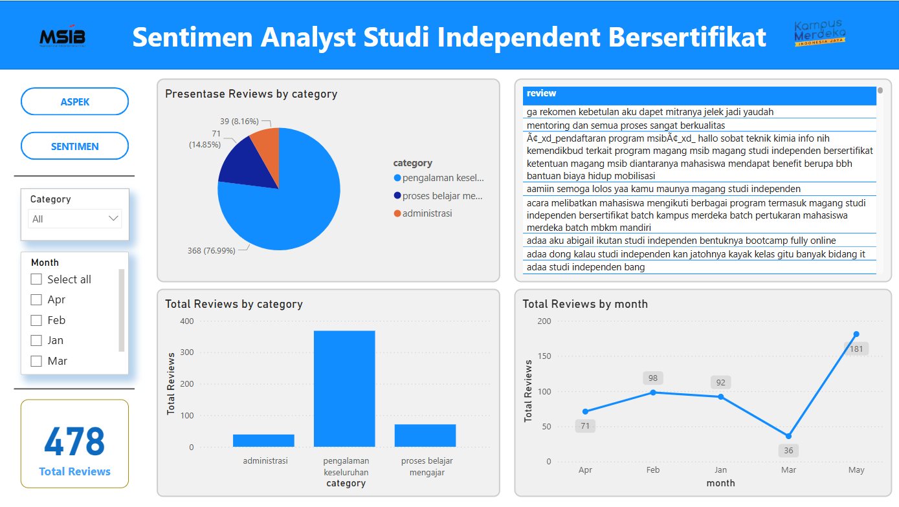
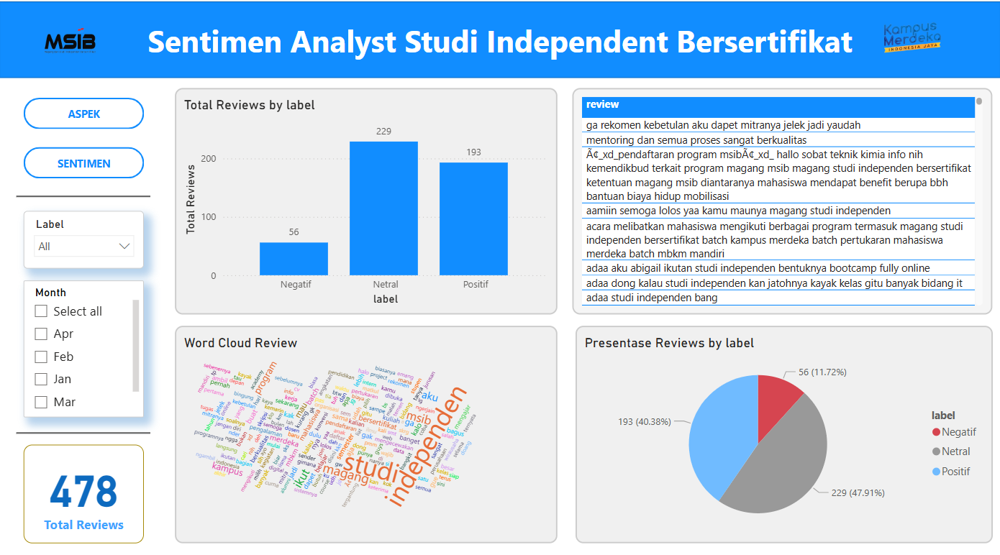

# Capstone-Project-Maribelajar-Batch-6
Capstone Project Maribelajar Batch 6 dengan judul Analisis Sentimen Review Program Studi Independen Bersertifikat Menggunakan Algoritma Support Vector Machine

Pada bagian ini, rancangan solusi menjelaskan tentang tahapan terkait proses dan perancangan atas permasalahan capstone project yang kami kerjakan dengan bantuan diagram alir/flowchart. Bagian ini menjelaskan tentang tahapan yang kami kerjakan mulai dari scraping data, membersihkan data hingga proses memvisualisasikan data menggunakan Power BI.

- Scraping Data Twitter: Proses ini dimulai dengan mengumpulkan data dari Twitter menggunakan teknik web scraping. Dengan menggunakan Python dan pustaka seperti Tweepy, data tweet yang berkaitan dengan topik atau kata kunci tertentu diambil dari platform Twitter.
- EDA Proses di Visual Studio Code: Setelah data diambil, langkah berikutnya adalah menganalisis data menggunakan Visual Studio Code (VS Code). Dalam tahap ini, Exploratory Data Analysis (EDA) dilakukan untuk memahami pola dan trend dalam data. VS Code menyediakan alat dan fitur yang kuat untuk menganalisis data dengan cepat dan efisien, seperti penyorotan sintaksis, debugger, dan ekstensi yang berguna untuk analisis data.
- Preprocessing Data: Data yang telah dikumpulkan kemudian diproses dan disiapkan untuk analisis lebih lanjut. Proses preprocessing ini melibatkan pembersihan data, normalisasi teks, dan penghapusan kata-kata yang tidak relevan atau tanda baca, stopword removal yang menghapus kata-kata umum yang dianggap tidak penting dalam pemrosesan teks, tokenisasi yang menghapus kata-kata umum yang dianggap tidak penting dalam pemrosesan teks, dan stemming yang mengurangi kata ke bentuk dasarnya (root form) dengan menghapus imbuhan seperti akhiran dan awalan. Preprocessing dilakukan untuk memastikan data siap untuk proses analisis sentimen.
- Membuat Model Labelling: Setelah data dilakukan preprocessing, langkah selanjutnya adalah membuat model labeling untuk mengklasifikasikan tweet menjadi kategori sentimen yang berbeda, seperti positif, negatif, atau netral. Namun sebelum itu data di translate terlebih dahulu ke dalam bahasa inggris agar menghasilkan labeling yang maksimal dengan menggunakan library tersebut. Model ini dibuat menggunakan algoritma pembelajaran mesin Support Vector Machine yang dapat diimplementasikan menggunakan Python di VS Code.
- Power BI Report: Setelah data dianalisis dan diberi label, hasilnya dapat divisualisasikan menggunakan Microsoft Power BI. Power BI menyediakan berbagai alat untuk membuat laporan interaktif dan dasbor yang menarik berdasarkan data yang telah diolah. Laporan ini dapat berisi grafik, diagram, dan tabel yang membantu dalam menyajikan temuan secara visual kepada pemangku kepentingan. Hasil  dashboard interaktif yang menyajikan hasil dari Sentimen Analisis ini dalam dua bagian utama, yaitu ringkasan aspek dan ringkasan sentimen.
1. Tampilan Dashboard Ringkasan Aspek

2. Tampilan Dashboard Ringkasan Sentimen

